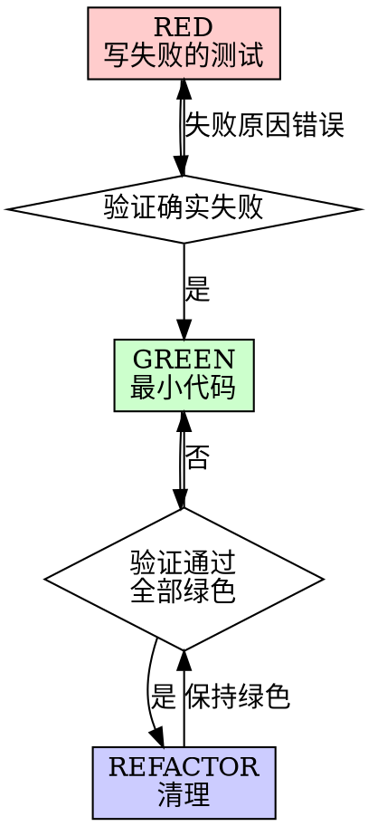

# Superpowers 项目深度解析 & LLM/Agent 面试准备指南

> 本文档基于对 Superpowers 项目的深度分析，为 LLM & Agent 方向的实习生面试准备提供系统性的知识点和考察点。

---

## 目录

1. [项目概述与核心价值](#1-项目概述与核心价值)
2. [架构设计深度解析](#2-架构设计深度解析)
3. [核心技能系统详解](#3-核心技能系统详解)
4. [关键技术实现细节](#4-关键技术实现细节)
5. [面试考察点：Prompt Engineering](#5-面试考察点prompt-engineering)
6. [面试考察点：Agent 架构设计](#6-面试考察点agent-架构设计)
7. [面试考察点：技能系统设计](#7-面试考察点技能系统设计)
8. [面试考察点：评估与测试方法](#8-面试考察点评估与测试方法)
9. [面试考察点：后训练与行为塑造](#9-面试考察点后训练与行为塑造)
10. [深度问题与思考](#10-深度问题与思考)
11. [项目亮点总结](#11-项目亮点总结)

---

## 1. 项目概述与核心价值

### 1.1 Superpowers 是什么？

Superpowers 是一个**完整的软件开发方法论**，通过可组合的技能（Skills）和初始化指令来增强 AI 编码代理的能力。它不是简单的提示词集合，而是一套经过精心设计的**行为塑造系统**。

**核心理念：**
- 将成熟的软件工程实践（TDD、代码审查、系统化调试）编码为 AI 可执行的技能
- 通过自动触发机制确保技能在正确的时机被激活
- 使用"人类伙伴"（human partner）而非"用户"的术语，强调协作关系

### 1.2 项目支持的平台

Superpowers 支持 11+ 个编码代理平台：
- **Claude Code** (官方插件市场)
- **OpenAI Codex** (App 和 CLI)
- **Cursor**
- **Gemini CLI**
- **GitHub Copilot CLI**
- **Kimi Code**
- **OpenCode**
- **Pi**
- 等等

**面试考察点：** 为什么一个技能系统需要支持这么多平台？这反映了什么设计哲学？

---

## 2. 架构设计深度解析

### 2.1 三层架构

```
┌─────────────────────────────────────────────────────────────┐
│                    Skills (平台无关)                          │
│  - 所有技能内容共享，描述"动作"而非"工具"                      │
│  - 位于 skills/ 目录，每个技能一个 SKILL.md                   │
└─────────────────────────────────────────────────────────────┘
                              ↓
┌─────────────────────────────────────────────────────────────┐
│                Tool Mapping (每平台)                          │
│  - 将动作词汇翻译为平台的真实工具名                            │
│  - 位于 references/<harness>-tools.md                        │
│  - 例如："dispatch a subagent" → 调用 task 工具               │
└─────────────────────────────────────────────────────────────┘
                              ↓
┌─────────────────────────────────────────────────────────────┐
│                 Bootstrap (每平台)                            │
│  - 会话开始时注入 using-superpowers 技能内容                   │
│  - 包装在 <EXTREMELY_IMPORTANT> 标签中                       │
│  - 这是整个集成的核心                                         │
└─────────────────────────────────────────────────────────────┘
```

### 2.2 三种集成形态

| 形态 | 机制 | 参考实现 |
|------|------|----------|
| **Shape A** | Shell Hook - 会话开始时运行 shell 命令，读取 stdout | Claude Code, Codex, Cursor |
| **Shape B** | 进程内插件 - JS/TS 模块的生命周期回调 | OpenCode, Pi |
| **Shape C** | 指令文件 - 扩展声明的上下文文件 | Gemini CLI |

**关键代码示例（hooks/session-start）：**

```bash
# 读取 using-superpowers 技能内容
using_superpowers_content=$(cat "${PLUGIN_ROOT}/skills/using-superpowers/SKILL.md")

# JSON 转义
escape_for_json() {
    local s="$1"
    s="${s//\\/\\\\}"
    s="${s//\"/\\\"}"
    s="${s//$'\n'/\\n}"
    printf '%s' "$s"
}

# 根据平台输出不同格式的 JSON
if [ -n "${CURSOR_PLUGIN_ROOT:-}" ]; then
  printf '{\n  "additional_context": "%s"\n}\n' "$session_context"
elif [ -n "${CLAUDE_PLUGIN_ROOT:-}" ] && [ -z "${COPILOT_CLI:-}" ]; then
  printf '{\n  "hookSpecificOutput": {\n    "hookEventName": "SessionStart",\n    "additionalContext": "%s"\n  }\n}\n' "$session_context"
else
  printf '{\n  "additionalContext": "%s"\n}\n' "$session_context"
fi
```

### 2.3 指令优先级

```
1. 用户的明确指令 (CLAUDE.md, GEMINI.md, AGENTS.md) — 最高优先级
2. Superpowers 技能 — 覆盖默认系统行为
3. 默认系统提示 — 最低优先级
```

**面试考察点：** 这种优先级设计解决了什么问题？如何处理指令冲突？

---

## 3. 核心技能系统详解

### 3.1 技能目录结构

```
skills/
├── brainstorming/                    # 头脑风暴
│   ├── SKILL.md
│   └── visual-companion.md          # 可视化伴侣
├── test-driven-development/          # 测试驱动开发
│   └── SKILL.md
├── subagent-driven-development/      # 子代理驱动开发
│   ├── SKILL.md
│   ├── implementer-prompt.md        # 实现者提示模板
│   └── task-reviewer-prompt.md      # 任务审查者提示模板
├── systematic-debugging/             # 系统化调试
│   ├── SKILL.md
│   ├── root-cause-tracing.md
│   └── defense-in-depth.md
├── writing-plans/                    # 编写计划
│   └── SKILL.md
├── writing-skills/                   # 编写技能（元技能）
│   └── SKILL.md
└── ... (14个技能)
```

### 3.2 核心工作流

```
用户请求
    ↓
brainstorming (头脑风暴)
    ↓ [探索需求、提出方案、获得批准]
writing-plans (编写计划)
    ↓ [创建详细的实现计划，每个任务2-5分钟]
using-git-worktrees (使用 Git Worktree)
    ↓ [创建隔离的工作空间]
subagent-driven-development (子代理驱动开发)
    ↓ [每个任务派遣新的子代理 + 两阶段审查]
requesting-code-review (请求代码审查)
    ↓ [任务间的审查]
finishing-a-development-branch (完成开发分支)
    [验证测试、呈现选项、清理]
```

### 3.3 关键技能深度解析

#### 3.3.1 Brainstorming (头脑风暴)

**触发条件：** 任何创造性工作之前 - 创建功能、构建组件、添加功能

**核心流程：**
1. 探索项目上下文
2. 提供可视化伴侣（按需）
3. 逐个提出澄清问题
4. 提出 2-3 种方案（含权衡分析）
5. 分段呈现设计，获得用户批准
6. 编写设计文档
7. 规格自审
8. 用户审查规格
9. 过渡到实现（调用 writing-plans）

**关键设计决策：**
- **硬门控：** 设计获批前禁止任何实现代码
- **一次一个问题：** 避免信息过载
- **多选优先：** 比开放式问题更容易回答
- **YAGNI 原则：** 无情地移除不必要的功能

```markdown
<HARD-GATE>
Do NOT invoke any implementation skill, write any code, scaffold any project, 
or take any implementation action until you have presented a design and the 
user has approved it. This applies to EVERY project regardless of perceived simplicity.
</HARD-GATE>
```

#### 3.3.2 Test-Driven Development (TDD)

**铁律：**
```
NO PRODUCTION CODE WITHOUT A FAILING TEST FIRST
```

**RED-GREEN-REFACTOR 循环：**



**反合理化表：**

| 借口 | 现实 |
|------|------|
| "太简单不需要测试" | 简单代码也会出错。测试只需30秒。 |
| "我之后再写测试" | 立即通过的测试证明不了任何东西。 |
| "测试后写也能达到同样目的" | 测试后 = "这代码做了什么？" 测试先 = "这代码应该做什么？" |
| "删除X小时的工作太浪费" | 沉没成本谬误。保留未验证的代码才是技术债。 |

#### 3.3.3 Subagent-Driven Development (子代理驱动开发)

**为什么用子代理：**
- 隔离上下文 - 精确控制子代理看到的信息
- 防止上下文污染 - 每个任务都是全新上下文
- 保留主会话上下文 - 用于协调工作

**核心流程：**

```
读取计划 → 创建任务列表
    ↓
Task 1: 
    → 派遣实现者子代理 (implementer-prompt.md)
    → 实现者实现、测试、提交、自审
    → 生成审查包 (review-package)
    → 派遣任务审查者 (task-reviewer-prompt.md)
    → 审查者返回：规格合规 ✅ + 代码质量 ✅
    → 如果有问题：派遣修复子代理 → 重新审查
    → 标记任务完成
    ↓
Task 2...N (重复)
    ↓
最终代码审查
    ↓
完成开发分支
```

**模型选择策略：**

| 任务类型 | 模型选择 |
|----------|----------|
| 机械实现任务（1-2个文件，清晰规格） | 快速、便宜的模型 |
| 集成和判断任务（多文件协调） | 标准模型 |
| 架构和设计任务 | 最强大的模型 |
| 审查任务 | 根据差异大小和复杂度选择 |

**进度持久化：**

```markdown
# 进度账本文件：.superpowers/sdd/progress.md
Task 1: complete (commits a7981ec..3df7661, review clean)
Task 2: complete (commits 3df7661..b42c8f9, review clean)
```

**面试考察点：** 为什么需要进度账本？对话记忆在什么情况下会丢失？

#### 3.3.4 Systematic Debugging (系统化调试)

**铁律：**
```
NO FIXES WITHOUT ROOT CAUSE INVESTIGATION FIRST
```

**四个阶段：**

1. **根本原因调查**
   - 仔细阅读错误信息
   - 一致地复现问题
   - 检查最近的更改
   - 在多组件系统中收集证据
   - 追踪数据流

2. **模式分析**
   - 找到工作示例
   - 与参考实现比较
   - 识别差异
   - 理解依赖关系

3. **假设和测试**
   - 形成单一假设
   - 最小化测试
   - 验证后继续

4. **实现**
   - 创建失败的测试用例
   - 实现单一修复
   - 验证修复
   - 如果3次修复失败 → 质疑架构

**3次修复规则：**
```markdown
如果进行了3次或更多修复尝试，停止并质疑架构：
- 每次修复都揭示新的共享状态/耦合/不同位置的问题
- 修复需要"大规模重构"
- 每次修复都在其他地方创建新的症状

这不是失败的假设 - 这是错误的架构。
```

---

## 4. 关键技术实现细节

### 4.1 技能发现优化 (SDO)

**描述字段设计：**

```yaml
# ❌ 错误：总结工作流 - 代理可能跳过技能内容
description: Use when executing plans - dispatches subagent per task with code review between tasks

# ✅ 正确：只描述触发条件
description: Use when executing implementation plans with independent tasks in the current session
```

**为什么？** 测试发现，当描述总结了工作流时，代理可能会遵循描述而不是阅读完整的技能内容。

**关键词覆盖：**
- 错误消息："Hook timed out", "ENOTEMPTY", "race condition"
- 症状："flaky", "hanging", "zombie", "pollution"
- 同义词："timeout/hang/freeze", "cleanup/teardown/afterEach"

### 4.2 反合理化技术

**匹配失败模式与正确形式：**

| 基线失败 | 正确形式 | 错误形式 |
|----------|----------|----------|
| 在压力下跳过/违反规则 | 禁止 + 合理化表 + 红旗 | 软指导（"倾向于..."） |
| 输出形状错误 | 正面配方或契约 | 禁止列表 |
| 遗漏必需元素 | 结构：模板中的必需字段 | 模板附近的散文提醒 |
| 行为应依赖于条件 | 基于可观察谓词的条件 | 无条件规则 + 豁免条款 |

**关键洞察：**
```markdown
禁止在塑造问题上适得其反：在竞争激励下（"使提示自包含"），
代理会与"不要 X"协商。在措辞测试中，禁止臂产生的不想要的内容
明显多于配方臂。
```

### 4.3 微测试措辞

```markdown
1. 每次调用一个新鲜上下文样本
2. 始终包含无指导对照
3. 每个变体 5+ 次重复
4. 手动阅读每个标记的匹配
5. 方差是一个指标 - 当指导落地时，重复收敛到相同形状
```

### 4.4 进度持久化机制

```bash
# 检查进度账本
cat "$(git rev-parse --show-toplevel)/.superpowers/sdd/progress.md"

# 任务完成后追加
echo "Task N: complete (commits <base7>..<head7>, review clean)" >> progress.md
```

**为什么需要这个？** 对话记忆在压缩后不会保留。在真实会话中，丢失位置的控制器会重新派遣整个已完成的任务序列 - 这是观察到的最昂贵的失败。

---

## 5. 面试考察点：Prompt Engineering

### 5.1 基础概念

**Q1: 什么是技能（Skill）？它与普通的提示词有什么区别？**

**考察点：**
- 理解技能是"行为塑造代码"而非普通提示
- 理解技能的触发机制和自动激活
- 理解技能的可组合性和层次结构

**参考答案：**
```
技能是经过精心设计的行为指南，具有以下特点：
1. 自动触发 - 通过描述字段和关键词匹配
2. 强制执行 - 不是建议，而是必须遵循的工作流
3. 可组合 - 技能可以调用其他技能
4. 可测试 - 通过压力场景验证有效性
5. 持续演化 - 基于实际使用反馈迭代
```

**Q2: 如何设计一个好的技能描述（Description）？**

**考察点：**
- 理解 SDO（技能发现优化）
- 理解"何时使用"vs"做什么"的区别
- 理解代理合理化行为

**参考答案：**
```
好的描述应该：
1. 以"Use when..."开头，聚焦触发条件
2. 包含具体的症状、情况和上下文
3. 不要总结技能的工作流（代理会走捷径）
4. 使用代理会搜索的关键词
5. 保持在500字符以内
```

### 5.2 进阶问题

**Q3: 为什么 Superpowers 使用"你的 human partner"而不是"用户"？**

**考察点：**
- 理解术语选择对代理行为的影响
- 理解协作关系的塑造

**Q4: 解释"违反规则的字面意思就是违反规则的精神"这句话的含义。**

**考察点：**
- 理解代理的"精神vs字面"合理化
- 理解为什么需要明确禁止这种合理化

---

## 6. 面试考察点：Agent 架构设计

### 6.1 子代理架构

**Q1: 为什么每个任务使用新的子代理，而不是复用同一个？**

**考察点：**
- 理解上下文污染问题
- 理解隔离上下文的好处
- 理解成本与质量的权衡

**参考答案：**
```
1. 防止上下文污染 - 之前的任务信息可能误导当前任务
2. 精确控制上下文 - 只提供当前任务需要的信息
3. 并行安全 - 子代理不会相互干扰
4. 成本优化 - 可以根据任务复杂度选择不同模型
```

**Q2: 如何处理子代理提出的问题？**

**考察点：**
- 理解交互式子代理设计
- 理解"在开始前澄清"的重要性

**Q3: 两阶段审查（规格合规 + 代码质量）解决了什么问题？**

**考察点：**
- 理解"过度构建"和"不足构建"的风险
- 理解代码质量与功能正确性的区别

### 6.2 并行代理调度

**Q4: 什么时候应该派遣并行代理？什么时候不应该？**

**考察点：**
- 理解任务独立性判断
- 理解共享状态的风险

**参考答案：**
```
应该：3+ 个测试文件以不同根本原因失败
不应该：失败相关（修复一个可能修复其他）
不应该：需要理解完整系统状态
不应该：代理会相互干扰（编辑相同文件）
```

---

## 7. 面试考察点：技能系统设计

### 7.1 技能设计原则

**Q1: 为什么技能应该描述"动作"而不是"工具"？**

**考察点：**
- 理解平台无关性设计
- 理解可移植性需求

**参考答案：**
```
技能描述动作（"派遣子代理"、"读取文件"）而不是具体工具名
（"Task"、"Read"），因为：
1. 不同平台有不同的工具名
2. 技能内容可以在所有平台共享
3. 工具映射在每平台的引用文件中维护
4. 技能内容可以被视为"精心调优的行为塑造代码"
```

**Q2: 如何测试一个技能的有效性？**

**考察点：**
- 理解 RED-GREEN-REFACTOR 用于技能创建
- 理解压力场景测试
- 理解微测试措辞

**参考答案：**
```
1. RED: 运行压力场景，没有技能，记录基线行为
2. GREEN: 编写最小技能，解决那些特定违规
3. REFACTOR: 发现新的合理化 → 堵住漏洞 → 重新验证

压力类型包括：时间压力、沉没成本、权威压力、疲劳
```

### 7.2 技能类型

**Q3: 纪律执行技能（如 TDD）和技术技能（如调试）有什么区别？如何设计它们？**

**考察点：**
- 理解不同技能类型的测试方法
- 理解禁止+合理化表 vs 正面配方

---

## 8. 面试考察点：评估与测试方法

### 8.1 评估框架

**Q1: Superpowers 使用什么评估方法？**

**考察点：**
- 理解 drill 评估框架
- 理解 LLM 验证器
- 理解真实会话测试

**参考答案：**
```
Superpowers 使用 drill 评估框架：
1. 驱动真实的 tmux 会话（Claude Code / Codex / Gemini CLI）
2. 使用 LLM 验证器判断技能合规性
3. 插件基础设施测试在 tests/ 目录
4. 技能行为测试在 superpowers-evals 仓库
```

**Q2: 如何验证一个端口（port）是否真正工作？**

**考察点：**
- 理解验收测试
- 理解"选择性加入不是端口"

**参考答案：**
```
验收测试：在干净会话中发送：
"Let's make a react todo list"

如果集成工作正常，brainstorming 技能会自动触发，
在任何代码编写之前。

不是真正的集成：
- 手动复制技能文件
- 需要用户每会话选择加入
- brainstorming 没有自动触发
```

### 8.2 质量门控

**Q3: 代码审查模板中的"Critical/Important/Minor"是如何定义的？**

**考察点：**
- 理解问题严重性分类
- 理解审查校准

---

## 9. 面试考察点：后训练与行为塑造

### 9.1 行为塑造技术

**Q1: Superpowers 如何防止代理"合理化"跳过规则？**

**考察点：**
- 理解反合理化表
- 理解红旗列表
- 理解"字面vs精神"论证

**参考答案：**
```
1. 明确禁止每种合理化方式
2. 创建合理化表，列出所有借口和现实
3. 使用红旗列表让代理自我检查
4. 添加基础原则："违反规则的字面意思就是违反精神"
5. 关闭每个漏洞 - 不要只是陈述规则，要禁止具体的变通方法
```

**Q2: 如何确保技能在"最大压力"下仍然被遵循？**

**考察点：**
- 理解压力场景测试
- 理解多压力组合测试

### 9.2 提示设计模式

**Q3: 解释"匹配失败模式与正确形式"的概念。**

**考察点：**
- 理解禁止 vs 配方 vs 结构 vs 条件
- 理解为什么禁止在某些情况下适得其反

**Q4: 什么是"微测试措辞"？为什么重要？**

**考察点：**
- 理解措辞对代理行为的微妙影响
- 理解方差作为指标

---

## 10. 深度问题与思考

### 10.1 系统设计问题

**Q1: 如果让你为一个新的 LLM 编码助手平台移植 Superpowers，你会怎么做？**

**考察点：**
- 理解三种集成形态（Shell Hook / 进程内插件 / 指令文件）
- 理解工具映射
- 理解引导注入机制

**Q2: 如何设计一个可扩展的技能系统，使其能够支持新的工作流？**

**考察点：**
- 理解技能的模块化设计
- 理解技能组合和依赖
- 理解技能发现机制

### 10.2 权衡与决策

**Q3: 为什么 Superpowers 选择零依赖设计？这带来了什么限制？**

**考察点：**
- 理解设计约束
- 理解权衡分析

**Q4: 如何平衡"强制执行严格工作流"和"保持灵活性"？**

**考察点：**
- 理解刚性技能 vs 灵活技能
- 理解用户指令优先级

### 10.3 未来方向

**Q5: 你认为 AI 编码助手的未来发展方向是什么？Superpowers 的设计理念如何适应这些变化？**

**考察点：**
- 行业趋势理解
- 技术前瞻性

---

## 11. 项目亮点总结

### 11.1 关键创新点

1. **技能即代码** - 将软件工程实践编码为可执行的行为指南
2. **自动触发机制** - 通过钩子和描述匹配实现技能的自动激活
3. **反合理化设计** - 预见并堵住代理可能的合理化漏洞
4. **平台无关架构** - 一套技能内容支持多个编码助手平台
5. **进度持久化** - 使用文件系统而不是对话记忆来跟踪进度
6. **两阶段审查** - 分离规格合规性和代码质量审查
7. **模型选择策略** - 根据任务复杂度选择不同能力的模型

### 11.2 可复用的设计模式

| 模式 | 应用场景 |
|------|----------|
| **硬门控** | 在关键检查点前阻止操作 |
| **合理化表** | 预见并反驳借口 |
| **红旗列表** | 让代理自我检查违规信号 |
| **进度账本** | 在文件系统中持久化状态 |
| **两阶段审查** | 分离不同类型的验证 |
| **微测试措辞** | 验证指导文本的有效性 |

### 11.3 面试准备建议

1. **理解核心工作流** - 能够从头到尾描述 brainstorming → writing-plans → subagent-driven-development 的流程
2. **理解设计决策** - 为什么选择这种设计？权衡了什么？
3. **理解技术细节** - 钩子机制、工具映射、引导注入
4. **能够提出改进建议** - 基于对项目的理解，提出合理的改进方向
5. **能够类比其他系统** - 与其他 Agent 框架（LangChain、AutoGPT 等）比较

---

## 附录：常见面试问题速查

| 问题 | 关键点 |
|------|--------|
| 什么是技能？ | 行为塑造代码，不是普通提示 |
| 为什么用子代理？ | 上下文隔离，防止污染 |
| 如何防止合理化？ | 合理化表 + 红旗列表 + 明确禁止 |
| 如何测试技能？ | 压力场景 + 微测试措辞 |
| 三种集成形态？ | Shell Hook / 进程内插件 / 指令文件 |
| 进度如何持久化？ | 文件系统账本，不依赖对话记忆 |
| 两阶段审查是什么？ | 规格合规 + 代码质量 |
| 如何选择模型？ | 根据任务复杂度，从便宜到强大 |

---

*本文档基于 Superpowers v6.0.3 分析编写，最后更新：2026-06-27*
